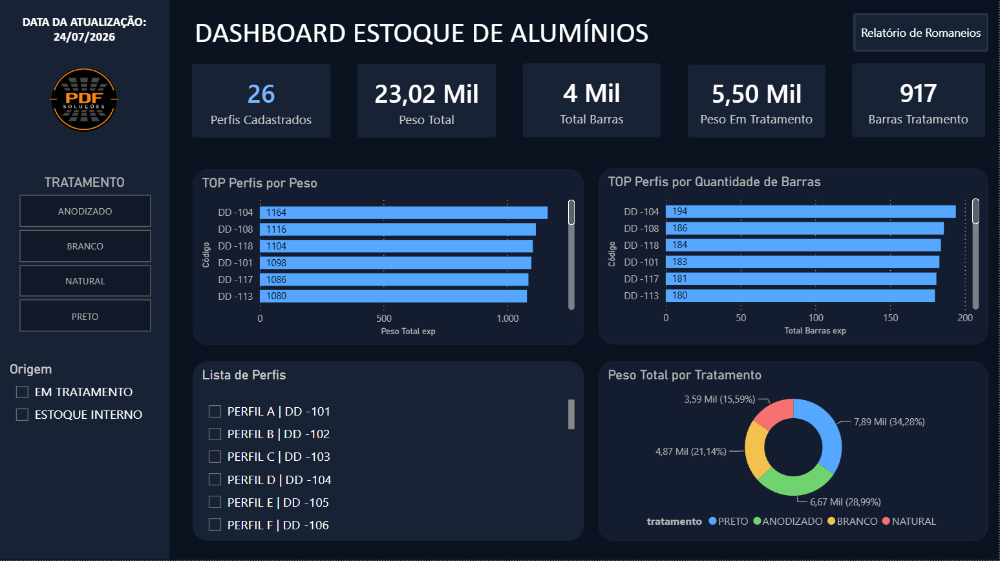

# Dashboard de Estoque de Alumínios

Projeto desenvolvido em Power BI para monitoramento do estoque interno e dos materiais enviados para tratamento superficial.

> Todos os dados apresentados foram anonimizados para fins de portfólio.

---

## Dashboard



---

## Tecnologias

- Power BI
- Power Query
- DAX
- Excel

---

## Estrutura

```text
assets/
sample-data/
pbix/
README.md
```
